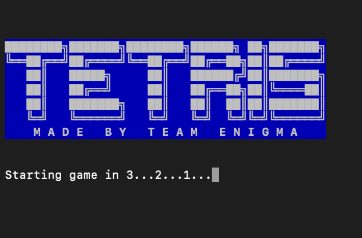
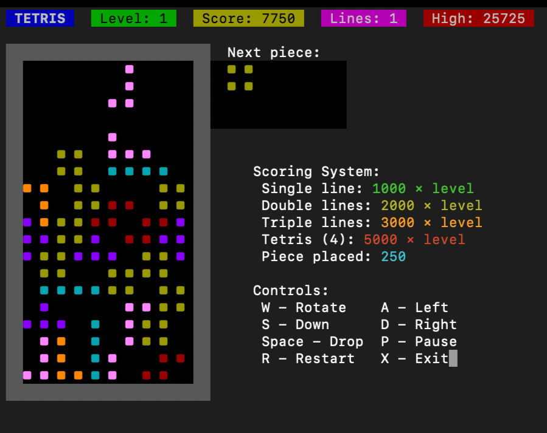
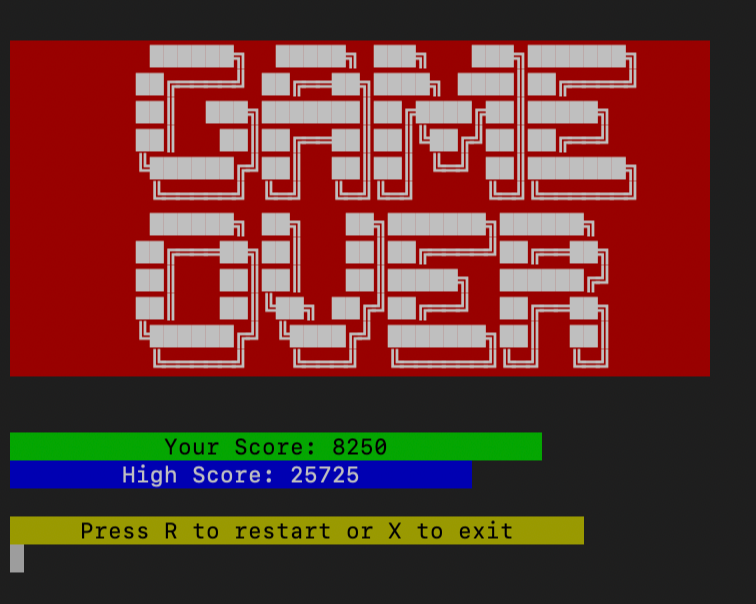

# 🎮 Tetris Game

A classic Tetris game written in C++ with a terminal-based interface and an engaging scoring system.

## 📖 Table of Contents
- [Features](#features)
- [Gameplay Mechanics](#gameplay-mechanics)
- [Scoring System](#scoring-system)
- [Installation & Run](#installation--run)
- [Game Controls](#game-controls)
- [Game Screenshots](#game-screenshots)
- [Technical Details](#technical-details)
- [Future Enhancements](#future-enhancements)
- [Contribution](#contribution)

## ✨ Features
- 🎲 Classic Tetris Gameplay with falling tetrominoes.
- ⚡ Increasing Speed as levels progress.
- 📊 Scoring System rewarding skillful play.
- 🎨 ASCII-based Graphics with intuitive display.
- 🔄 Rotatable Tetrominoes for strategic placement.
- 💾 Efficient Game Loop for smooth gameplay.

## 🔄 Gameplay Mechanics
- Blocks (Tetrominoes) fall from the top of the grid.
- Players must move and rotate pieces to fit them into complete rows.
- Complete rows disappear, making space for new pieces.
- The game ends when pieces stack up to the top.
- Speed increases after every two rows cleared, making the game progressively harder.

## 📊 Scoring System
| Action              | Points Earned         |
|--------------------|----------------------|
| Each piece placed | 250 points           |
| Single line clear | 1000 × level points  |
| Double lines clear | 2000 × level points  |
| Triple lines clear | 3000 × level points  |
| Tetris (4 lines) clear | 5000 × level points  |

- Level increases after clearing two rows.
- Higher levels mean faster drop speeds, making the game more challenging.

## 📚 Installation & Run

### 1️⃣ Clone the Repository
```sh
git clone https://github.com/RudraBhat/tetris-game.git
cd tetris-game
```

### 2️⃣ Compile & Run
#### 🖥️ Windows
```sh
g++ Tetris.cpp -o tetris.exe -static-libstdc++ -static-libgcc
./tetris.exe
```
#### 🖥️ Linux/Mac
```sh
g++ Tetris.cpp -o tetris
./tetris
```

## 🎯 Game Controls
| Key    | Action        |
|--------|--------------|
| W      | Rotate       |
| A      | Move Left    |
| D      | Move Right   |
| S      | Soft Drop    |
| Space  | Hard Drop    |
| P      | Pause        |
| R      | Restart      |
| X      | Exit         |

## 🖼️ Game Screenshots
Here are some images showcasing the gameplay:





## ⚙️ Technical Details
- Uses 2D array representation for the Tetris grid.
- Randomized tetromino generation for fair gameplay.
- Collision detection ensures valid moves.
- Clearing rows updates the grid efficiently.
- Increasing difficulty as levels progress.

## 🛠️ Future Enhancements
- 🎨 Colorized Graphics for better visuals.
- 🎵 Sound Effects for an immersive experience.
- 🏆 Leaderboard System to track high scores.
- 🔥 Power-Ups & Special Blocks for unique twists.

## 💪 Contribution
1. Fork the repository.
2. Create a new branch (`feature-xyz`).
3. Commit your changes (`git commit -m "Added xyz feature"`).
4. Push your branch (`git push origin feature-xyz`).
5. Open a Pull Request!

## 👥 Contributors
- @RudraBhatt (Main Developer)

Enjoy the game! 🚀
